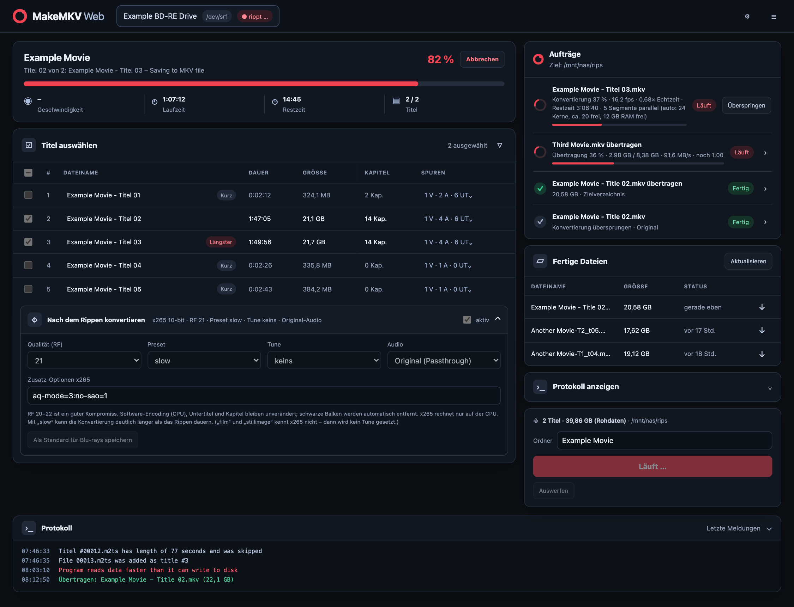

# MakeMKV-Web

Headless [MakeMKV](https://www.makemkv.com/) mit Browser-Oberfläche. USB-/SATA-Laufwerk an einen Server anstecken,
Disc einlegen – sie wird live erkannt, automatisch analysiert, und alles Weitere (Titel wählen, rippen, auswerfen)
passiert im Browser.

- Live-Erkennung von Laufwerk und Disc (Einlegen, Auswerfen, Abziehen)
- Automatische Analyse neu eingelegter Discs (DVD / Blu-ray)
- Titelliste mit Dauer, Größe, Kapiteln, Spuren; Dateinamen und Zielordner editierbar
- Rippen als MKV oder entschlüsseltes Disc-Backup, Fortschritt mit Restzeit, Abbrechen, Protokoll
- Sprachfilter für Audio/Untertitel, Auto-Auswerfen, Dateiliste mit Download/Löschen
- Zwischenspeicher: Jeder Titel wird zuerst lokal gerippt und nach seiner Fertigstellung im Hintergrund ins Ziel (z. B. NAS) übertragen, während schon der nächste Titel läuft – langsames Netz bremst das Rippen nicht
- Konvertierung nach dem Rippen (x265 10-bit, ffmpeg): Preset je Disc-Art (Blu-ray vorausgewählt), im Browser änderbar; große Filme werden automatisch nach freien Kernen/RAM in Segmente geteilt und parallel kodiert
- Tab „Bibliothek“: vorhandene Dateien im Ziel nachträglich konvertieren – das Original wird nach bestandener Prüfung ersetzt; Sperrdateien verhindern, dass zwei Instanzen dieselbe Datei bearbeiten
- Übertragungs-Kachel mit Geschwindigkeit und Restzeit
- Ausgabe in ein eingehängtes Netzlaufwerk (NFS/SMB), sonst lokaler Fallback
- Übersteht USB-Resets des Laufwerks (wartet und wiederholt den Schritt automatisch)



## Installation

Voraussetzung: Linux mit Docker + Compose-Plugin.

```bash
git clone <dieses Repo> makemkv-web && cd makemkv-web
./install.sh
```

Das Script lädt `sg`/`sr_mod`, legt `.env` an, fragt nach der MakeMKV-EULA, ermittelt die **neueste MakeMKV-Version**
von makemkv.com, baut das Image und startet den Container. Danach: `http://<server>:8780`.

Aktualisieren (neue MakeMKV-Version, z. B. weil die Beta nach 60 Tagen abläuft): einfach `./install.sh` erneut ausführen.

## Konfiguration (`.env`)

| Variable | Bedeutung |
|---|---|
| `PORT` | Web-Port (8780) |
| `PUID`/`PGID` | Besitzer der gerippten Dateien |
| `CDROM_GID` | Gruppe `cdrom` des Hosts |
| `NAS_MOUNT` | Pfad des eingehängten Ziels auf dem Host |
| `OUTPUT_DIR` | Ausgabeordner (unter `NAS_MOUNT`); ist `NAS_MOUNT` nicht gemountet, wird lokal in `data/output` gespeichert |
| `AUTH_USER`/`AUTH_PASS` | Optionaler Passwortschutz (HTTP Basic). Ohne `AUTH_PASS` ist die Oberfläche offen |
| `STAGING_PATH` | Lokaler Zwischenspeicher (Standard `data/staging`); braucht Platz für den größten Titel (ca. 50 GB bei Blu-ray, bei Konvertierung mehr) |
| `HIDE_DRIVES` | Regex für Laufwerke, die nicht angezeigt werden (Standard: `cdemu\|virtual\|qemu\|vbox`, leer = alle zeigen) |
| `INSTANCE_NAME` | Name dieser Instanz (erscheint in Sperrdateien; `install.sh` setzt den Hostnamen) |
| `MKV_VERSION` | `latest` oder feste Version |

NFS-Beispiel (`/etc/fstab`, ohne Automount, damit Docker den Pfad einbinden kann):

```
192.0.2.10:/export/data /mnt/nas nfs4 rw,nofail,_netdev,x-systemd.mount-timeout=20 0 0
```

## Hinweise

- **MakeMKV** ist teils Open Source (GPL/LGPL), `makemkv-bin` aber proprietär. Dieses Repo enthält kein MakeMKV;
  es wird beim Bauen von makemkv.com geladen. Die [EULA](https://www.makemkv.com/eula/) gilt für dich.
- Ohne eigenen Key nutzt die App den öffentlichen Beta-Key aus dem [MakeMKV-Forum](https://forum.makemkv.com/forum/viewtopic.php?f=5&t=1053).
  Eigener Key: Einstellungen in der Oberfläche.
- Ohne `AUTH_PASS` hat die Oberfläche **keine Anmeldung** – wer sie erreicht, kann rippen und Dateien löschen. Nur im vertrauenswürdigen LAN betreiben, nie ungeschützt ins Internet stellen. Auch mit Passwort gilt: nur über HTTPS/VPN von außen erreichbar machen.
- Nur eigene Discs kopieren und nur, soweit es das geltende Recht erlaubt (Umgehung von Kopierschutz ist in manchen Ländern eingeschränkt).

## Aufbau

`app/main.py` (FastAPI, ruft `makemkvcon -r` auf, ioctl-Laufwerkserkennung, Server-Sent-Events) ·
`app/index.html` (Single-Page-UI ohne Build-Schritt) · `Dockerfile` · `docker-compose.yml` · `install.sh`

## Lizenz

MIT (siehe [LICENSE](LICENSE)). MakeMKV ist ein Produkt von GuinpinSoft inc; dieses Projekt ist nicht mit MakeMKV verbunden oder von dessen Hersteller unterstützt.
